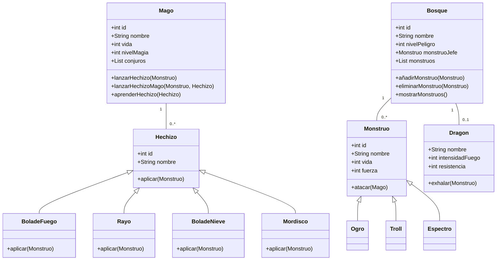

Ampliacion del juego:
Yo de ampliacion pondria que los monstruos pueden atacar al dragon y este morir y tambien que puedan haber hordas de enemigos, asi como atacan varios magos a la vez que te puedan atacar varios monstruos a la vez
